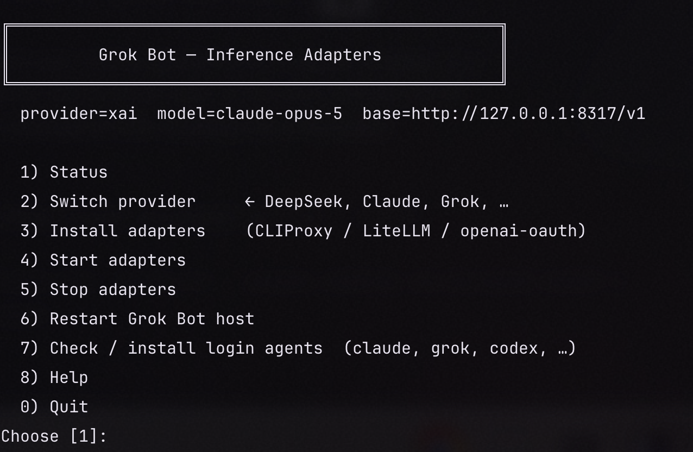

# grok-bot-setup

[](https://github.com/BlockedPath/grok-bot-setup/actions/workflows/ci.yml)
[](https://www.npmjs.com/package/grok-bot-setup)
[](https://www.npmjs.com/package/grok-bot-setup)
[](LICENSE)
[](https://www.npmjs.com/package/grok-bot-setup)
[](https://github.com/BlockedPath/grok-bot-setup)
[](https://github.com/BlockedPath/grok-bot-setup)
[](https://github.com/BlockedPath/grok-bot-setup)
[](https://github.com/BlockedPath/grok-bot-setup)

CLI to point **Grok Bot** at custom model providers — DeepSeek, Claude, Grok, OpenAI, OpenRouter, ChatGPT/Codex, or any OpenAI-compatible URL.

```bash
npm install -g grok-bot-setup
adapters
```



## Install

### npm (recommended)

```bash
# one-shot
npx grok-bot-setup

# global (puts `adapters` on PATH)
npm install -g grok-bot-setup
adapters help
```

Also available as the `grok-bot-setup` command (same CLI).

### Other ways

<details>
<summary>curl (single script)</summary>

```bash
curl -fsSL https://raw.githubusercontent.com/BlockedPath/grok-bot-setup/main/adapters.sh \
  -o ~/.local/bin/adapters
chmod +x ~/.local/bin/adapters
```

</details>

<details>
<summary>git clone</summary>

```bash
git clone https://github.com/BlockedPath/grok-bot-setup.git
cd grok-bot-setup
./adapters
```

</details>

## Quick start

```bash
# 1) Install optional proxies + login CLIs (as needed)
adapters install all
adapters install login-agents

# 2) Log in to the providers you care about
claude login    # Claude Pro/Max OAuth
grok login      # Grok session
codex login     # ChatGPT / Codex OAuth

# 3) Point Grok Bot at a provider
adapters use deepseek
# or: claude | grok-session | openai | openrouter | xai-api | litellm | openai-oauth | direct | cursor

# 4) Check status anytime
adapters status
```

Or just run **`adapters`** with no args for the interactive menu.

## Prerequisites

- Sand / Grok Bot host (`~/sand-host`, `~/sand-data`)
- `bash`, `curl`, `python3`
- Only if you use that adapter:
  - **CLIProxy** (Claude OAuth) → Go
  - **LiteLLM** bridge → [`uv`](https://docs.astral.sh/uv/)
  - **openai-oauth** (Codex) → Node / `npx`

## Commands

| Command | What it does |
|---------|----------------|
| `adapters` | Interactive menu |
| `adapters status` | Current provider + adapter ports |
| `adapters check-logins` | Claude / Grok / Codex CLI login state |
| `adapters install [target]` | Download adapters or login CLIs |
| `adapters start [target]` | Start local proxies |
| `adapters stop [target]` | Stop local proxies |
| `adapters use <profile>` | Switch Grok Bot provider |
| `adapters restart-host` | Restart Sand host to pick up config |
| `adapters help` | Full help |

### Install targets

`all` · `cliproxy` · `litellm` · `openai-oauth` · `claude` · `grok` · `codex` · `login-agents`

### Start / stop targets

`all` · `cliproxy` (`:8317`) · `litellm` (`:4000`) · `openai-oauth` (`:10531`)

## Provider profiles (`adapters use …`)

| Profile | Backend | Auth |
|---------|---------|------|
| `deepseek` | api.deepseek.com | DeepSeek API key |
| `claude` / `cliproxy` | CLIProxy `:8317` or LiteLLM | `claude login` **or** Console API key |
| `grok-session` / `grok` | Grok cli-chat-proxy | `grok login` |
| `xai-api` / `xai` | api.x.ai | xAI API key |
| `openai` | OpenAI Platform | `OPENAI_API_KEY` |
| `openrouter` | OpenRouter | `OPENROUTER_API_KEY` |
| `litellm` / `bridge` | LiteLLM `:4000` | master key in bridge `.env` |
| `openai-oauth` / `codex` | openai-oauth `:10531` | `codex login` |
| `direct` | Any OpenAI-compatible URL | `--base-url` + `--key` + `--model` |
| `cursor` / `stock` | Stock Cursor path | disables custom provider |

### Flags

```bash
adapters use deepseek --model deepseek-chat --key sk-...
adapters use claude --model claude-opus-5 --oauth --thinking enabled --reasoning-effort medium
adapters use claude --model claude-sonnet-4-5 --auth api_key --key sk-ant-...
adapters use deepseek --thinking medium          # shorthand: enable + effort=medium
adapters use openai --model gpt-4o --key sk-...
adapters use direct --base-url https://example.com/v1 --model my-model --key KEY
```

- `--model ID` — skip model prompt  
- `--key KEY` — skip API-key prompt (or use env vars like `OPENAI_API_KEY`)  
- `--auth oauth|api_key` — Claude auth mode  
- `--thinking enabled|disabled` — model thinking / chain-of-thought (writes `SAND_XAI_THINKING`)  
- `--reasoning-effort low|medium|high` — reasoning level (writes `SAND_XAI_REASONING_EFFORT`; implies thinking on)  
- `--thinking medium` — shorthand for enabled + effort `medium` (also `low` / `high`)  


## What it writes

| Path | Purpose |
|------|---------|
| `~/sand-data/xai-inference.env` | Active provider config (loaded by the host) |
| `~/sand-data/settings.json` | `agentDefaultModel` (when switched) |
| `~/.local/share/grok-bot-adapters/` | Local proxy trees from `adapters install` |

Override the local data dir with `ADAPTERS_DATA=/path`.

## Docs

- Full runbook: [docs/GUIDE_CUSTOM_INFERENCE.md](docs/GUIDE_CUSTOM_INFERENCE.md)
- HTML: [docs/GUIDE_CUSTOM_INFERENCE.html](docs/GUIDE_CUSTOM_INFERENCE.html)
- CLI: `adapters help`
- Repo: https://github.com/BlockedPath/grok-bot-setup
- npm: https://www.npmjs.com/package/grok-bot-setup

## Contributing

- [Contributing guide](CONTRIBUTING.md)
- [Code of conduct](CODE_OF_CONDUCT.md)
- Bug / feature forms open automatically when you [file an issue](https://github.com/BlockedPath/grok-bot-setup/issues/new/choose)
- PRs use [.github/PULL_REQUEST_TEMPLATE.md](.github/PULL_REQUEST_TEMPLATE.md)
